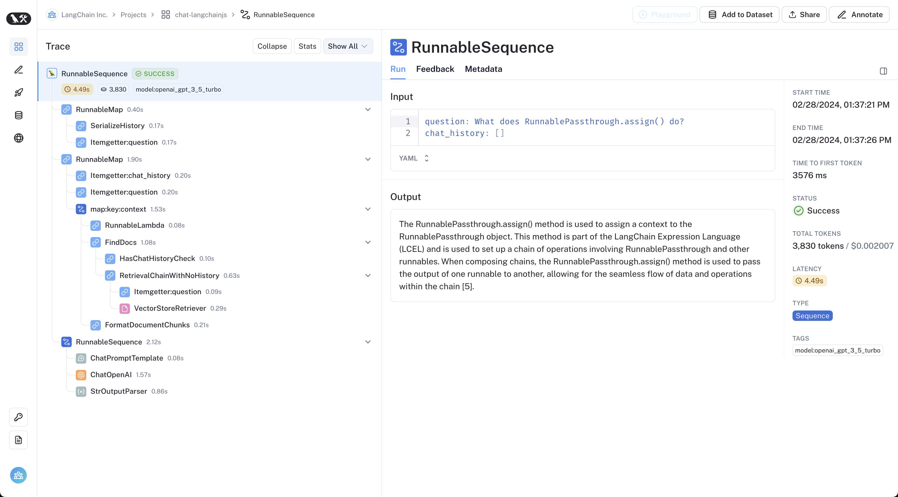
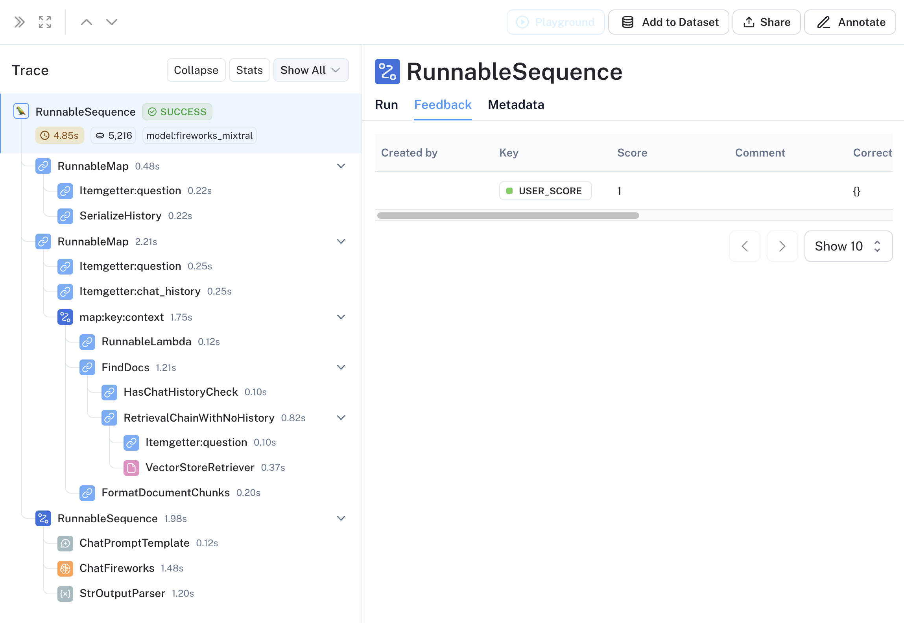

# LangSmith

Observability and evaluations are pivotal to any LLM application looking to be productionized, and improve beyond initial deployment.
For this, we use LangSmith, a tool that encapsulates all the necessary components to monitor and improve your LLM applications.
In addition to these two development tools, LangSmith also offers a feature for managing feedback from users.
Getting real user feedback can be invaluable for improving your LLM application, based on facts from actual users, and not just assumptions/theories.

## Observability

Observability is simple when using LangChain as your LLM framework. In its simplest form, all you need is to set two environment variables:

```shell
LANGCHAIN_TRACING_V2=true
LANGCHAIN_API_KEY=...
```

Sometimes need to pass a config object through to different functions, like so:

```typescript
new RunnableLambda({ func: (input, config ) => yourRunnable.invoke(input, config) })
```

Doing this keeps all your traces inside the same run in LangSmith, making it easier to debug and track the different paths your application took.

LangSmith tracing is already setup in an optimized way for Chat LangChain, and only needs extra configuration if you're extending the application in a way that's not covered by the default tracing. When running queries through Chat LangChain, you can expect to see LangSmith traces like this show up on your project:



For more detailed information on LangSmith traces, visit the [LangSmith documentation](https://docs.smith.langchain.com/tracing/).

## Evaluations

Evals are a great way to discover issues with your LLM app, areas where it does not perform well, and track regression. LangSmith has a whole suite of tools to aid you with this.

For in depth walkthroughs and explanations of LangSmith evaluations, visit the [LangSmith documentation](https://docs.smith.langchain.com/evaluation). This doc will only go over setting up and running evals on Chat LangChain.

### Datasets

For Chat LangChain, the team at LangChain has already put together a dataset for evaluating the app. Although this dataset was built for the Python version, many of the questions still apply to the TypeScript version, or require slight modifications.

You can find the dataset [here](https://smith.langchain.com/public/452ccafc-18e1-4314-885b-edd735f17b9d/d).

The first step is to download the LangSmith node SDK:

```shell
yarn add langsmith
```

Then, you'll want to define some custom criteria to evaluate your dataset on. Some examples are:

- **Semantic similarity**: How similar your generated response is to the ground truth (dataset answers).
- **LLM as a judge**: Use an LLM to judge and assign a score to your generated response.

Finally, configure your evaluation criteria and use the [`runOnDataset`](https://api.js.langchain.com/functions/langchain_smith.runOnDataset.html) function to evaluate your dataset.

Once completed, you'll be able to view the results of your evaluation in the LangSmith dashboard. Using these results, you can improve and tweak your LLM.

## Feedback

Gathering feedback from users is a great way to gather human curated data on what works, what doesn't and how you can improve your LLM application. LangSmith makes tracking and gathering feedback as easy as pie.

Currently, Chat LangChain supports gathering a simple 👍 or 👎, which is then translated into a binary score, and saved to each run in LangSmith. This feedback is then stored in the --you guessed it-- feedback tab of the LangSmith trace:



Then, inside LangSmith you can efficiently use this data to visualize and understand your user's feedback, as well as curate datasets by feedback for evaluations.

### Go further

In addition to binary scores for feedback, LangSmith also allows for assigning comments to feedback. This can allow for you to gather more detailed and complex feedback from users, further fueling your human curated dataset for improving your LLM application.