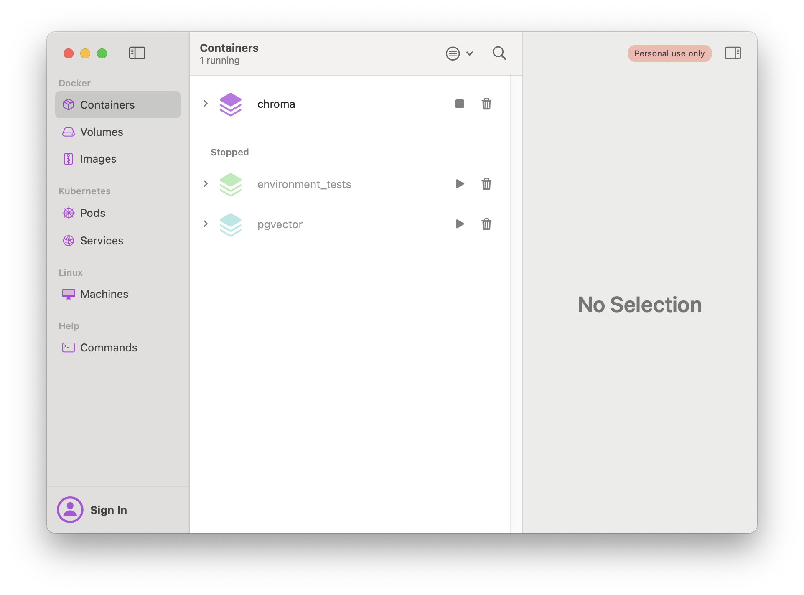
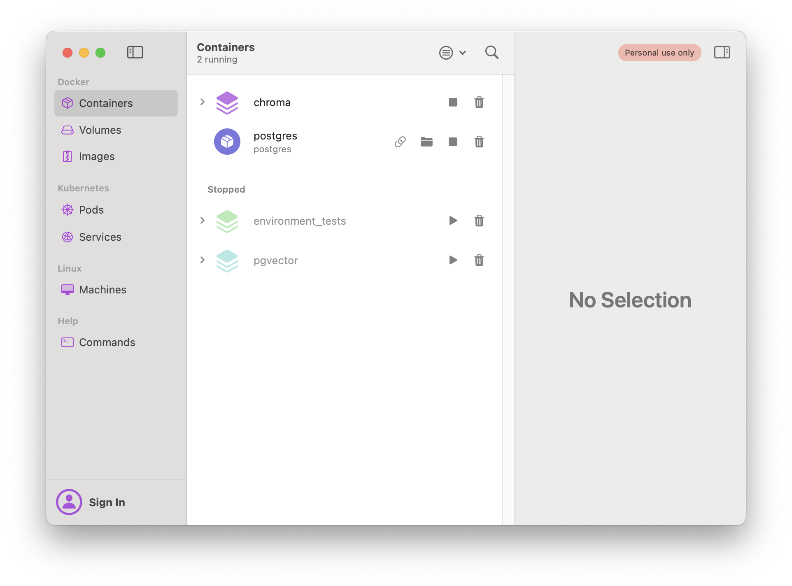

# Running locally

If you wish to run this 100% locally, you'll need to update a few pieces of the code, and download extra software. Because this application was built on top of the LangChain framework, modifying the code to run locally is simple.

## Requirements

To run locally, we'll employ [Ollama](https://ollama.com) for LLM inference and embeddings generation. For the vector store we'll use [Chroma](https://www.trychroma.com/), a free open source vector store. For the record manager, we'll use a simple PostgreSQL database. And finally, to run Chroma and PostgreSQL you'll need to install Docker.

## Steps

### Docker

To download and manage Docker containers with a GUI, you can download OrbStack [here](https://orbstack.dev/download). Once setup, we can install Chroma and PostgreSQL.

### Chroma

To download and start a Docker container running Chroma, first clone the official Chroma repository:

```shell
git clone git@github.com:chroma-core/chroma.git
```

Next, navigate into the cloned repository and start the Docker container:

```shell
cd chroma
docker-compose up -d --build
```

That's it! Now, if you open OrbStack you should see a container named "Chroma" running.



### PostgreSQL

First, pull the PostgreSQL image:

```shell
docker pull postgres
```

Then, run this command to start the image.

```shell
docker run --name postgres -e POSTGRES_PASSWORD=mysecretpassword -d postgres
```

Change "mysecretpassword" to your desired password.

Once finished you should see a second container running in OrbStack named "postgres"



### Ollama

To download Ollama, click [here](https://ollama.com/download) and select your operating system to download. Follow along with their onboarding setup.

Next, download the following models:

- [**mistral**](https://ollama.com/library/mistral): This model will be used for question rephrasing and answer generation.
- [**nomic-embed-text**](https://ollama.com/library/nomic-embed-text): We'll use this model for embeddings generation.

## Code changes

### Ingest script

To update your ingest script to run using Chroma and your locally running PostgreSQL image, you only need to modify a few lines of code. First, navigate to the [`/backend/src/ingest.ts`](/backend/src/ingest.ts) file.

Then, find the `ingestDocs` function and update the first if statement to instead check for your PostgreSQL database credentials.

```shell
DATABASE_HOST="127.0.0.1"
DATABASE_PORT="5432"
DATABASE_USERNAME="postgres"
DATABASE_PASSWORD="mysecretpassword"
DATABASE_NAME="your-db-name" # Replace this with your database name.
```

You'll also need to create a database inside your PostgreSQL container:

```shell
docker exec -it postgres createdb -U postgres your-db-name
```

Next, find the `getEmbeddingsModel` and replace its contents with an [`OllamaEmbeddings`](https://api.js.langchain.com/classes/langchain_community_embeddings_ollama.OllamaEmbeddings.html) instance:


```typescript
import { OllamaEmbeddings } from "@langchain/community/embeddings/ollama";

function getEmbeddingsModel(): Embeddings {
  return new OllamaEmbeddings({
    model: "nomic-embed-text",
  });
}
```

For our databases, we'll want to set one more environment variable to track our collection name (similar to the index name for Weaviate):

```shell
COLLECTION_NAME="your-collection-name" # Change this to your collection name
```

Directly below where this function is invoked, you can delete the `WeaviateStore` class instantiation and replace it with a `Chroma` class instantiation:

```typescript
import { Chroma } from "@langchain/community/vectorstores/chroma";

const vectorStore = new Chroma(embeddings, {
  collectionName: process.env.COLLECTION_NAME
});
```

Then, update the record manager namespace:

```typescript
const recordManager = new PostgresRecordManager(
  `local/${process.env.COLLECTION_NAME}`,
  {
    postgresConnectionOptions: connectionOptions,
  }
);
```

Finally, you can delete the Weaviate specific stats code at the end of the function (this is just for logging info on how many items are stored in the database).

### API Endpoints

Next, we need to update the API endpoints to use Ollama for local LLM inference, and Chroma for document retrieval.

Navigate to the [`/api/chat/stream_log`](frontend/app/api/chat/stream_log/route.ts) endpoint.

First, find the `getRetriever` function and remove the if statement checking for Weaviate environment variables, the Chroma LangChain.js integration does not require any!

Then, replace the Weaviate specific code with Chroma and Ollama embeddings:

```typescript
import { Chroma } from "@langchain/community/vectorstores/chroma";
import { OllamaEmbeddings } from "@langchain/community/embeddings/ollama";

const embeddings = new OllamaEmbeddings({
  model: "nomic-embed-text",
});
const vectorstore = await Chroma.fromExistingCollection(
  embeddings,
  {
    collectionName: process.env.COLLECTION_NAME
  },
);
```

Finally, find the `POST` function and replace the `if` statements with a single llm variable instantiation:

```typescript
import { ChatOllama } from "@langchain/community/chat_models/ollama";

const llm = new ChatOllama({
  model: "mistral"
});
```

Now you're done! You can run the application 100% locally with just two commands:

1. Ingest docs:

```shell
cd ./backend && yarn build && yarn ingest
```

2. Start the Next.js application:

```shell
cd ./frontend && yarn build && yarn start
```