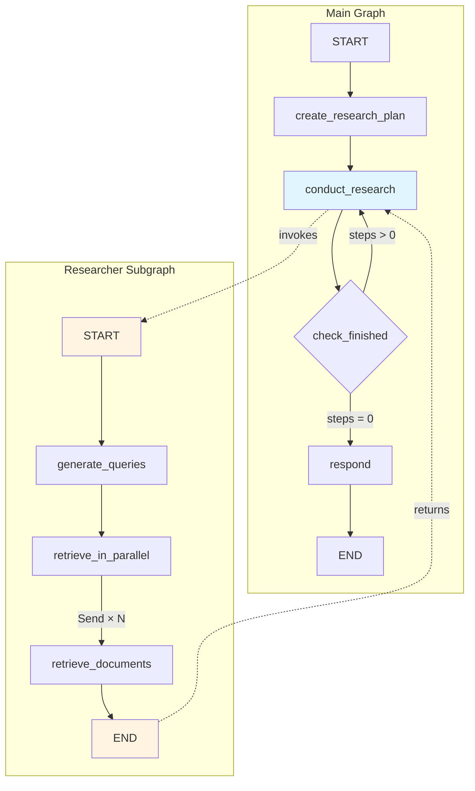
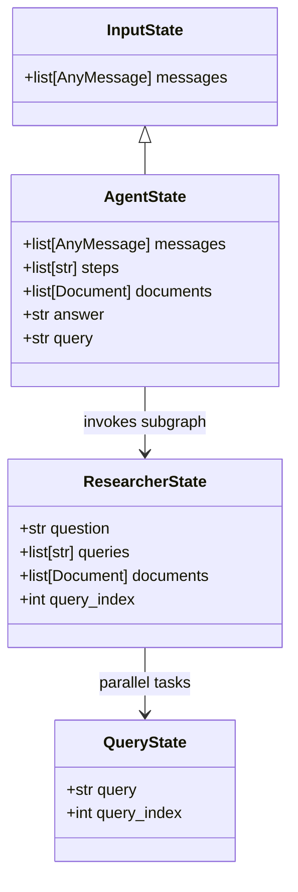
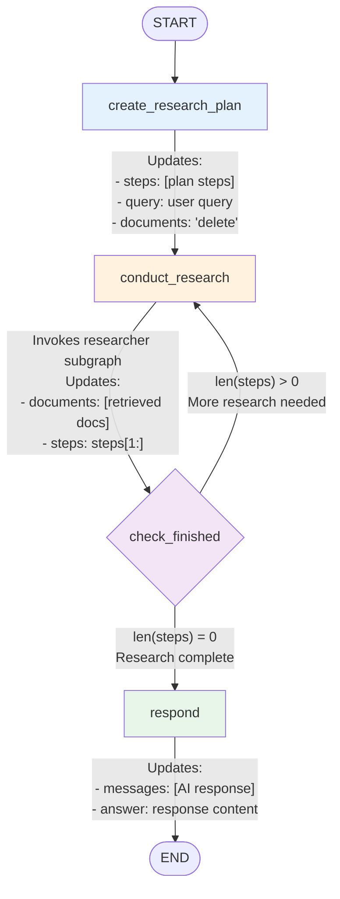
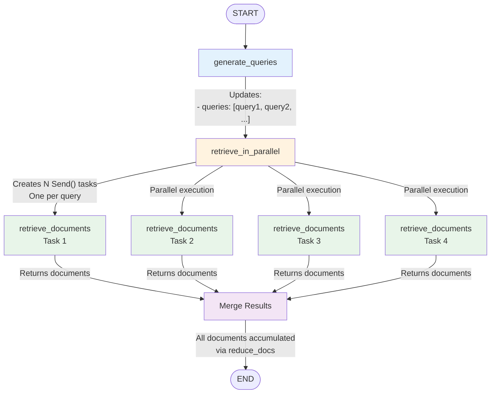

# Understanding LangGraph > Multi-Agent Research Workflows

A comprehensive guide to understanding how Chat LangChain uses LangGraph to build sophisticated multi-step research workflows with parallel document retrieval.

> **Learning Journey:** This is part of my exploration of the [Chat LangChain](https://github.com/langchain-ai/chat-langchain) open-source project.
>
> **Source Repository:** [langchain-ai/chat-langchain](https://github.com/langchain-ai/chat-langchain)  
> **Practice Repository:** [thongvmdev/chat-langchain-practice](https://github.com/thongvmdev/chat-langchain-practice)

---

## 🚨 Problem & Solution

### The Challenge

After learning document ingestion and basic retrieval, I wanted to understand how to build **intelligent, multi-step research systems** that can:

1. **Break down complex questions** into research steps
2. **Retrieve documents in parallel** for efficiency
3. **Accumulate knowledge** across multiple research iterations
4. **Generate comprehensive answers** from all gathered information

Simple RAG systems answer questions with a single retrieval step. But what if the question requires multiple research angles? How do you coordinate parallel searches? How do you manage state across multiple steps?

### The Solution: LangGraph Workflows

I discovered that Chat LangChain uses **LangGraph** to build sophisticated agent workflows:

**Key Concepts:**

- **State Graphs**: Manage complex state across multiple steps
- **Subgraphs**: Modular, reusable components (researcher subgraph)
- **Parallel Processing**: Use `Send` API for concurrent document retrieval
- **Conditional Routing**: Dynamic flow control based on state
- **State Reducers**: Smart accumulation of documents and messages

**Benefits:**

- ✅ **Multi-Step Research**: Break complex questions into manageable steps
- ✅ **Parallel Efficiency**: Retrieve documents concurrently (4x faster!)
- ✅ **State Management**: Clean separation between input and internal state
- ✅ **Modular Design**: Reusable subgraphs for different research patterns
- ✅ **Type Safety**: Full type hints for better developer experience

---

## Table of Contents

1. [Architecture Overview](#architecture-overview)
2. [State Management](#state-management)
3. [Main Graph Flow](#main-graph-flow)
4. [Researcher Subgraph Flow](#researcher-subgraph-flow)
5. [Key Learnings](#key-learnings)

---

## Architecture Overview

### Two-Level Graph Design

The retrieval graph system uses a **hierarchical architecture** with two main components:

1. **Main Graph (RetrievalGraph)**: Orchestrates the overall research and response generation process

   - Plans research steps
   - Coordinates multiple research iterations
   - Generates final comprehensive answers

2. **Researcher Subgraph**: Handles parallel document retrieval for each research step
   - Generates diverse search queries
   - Executes parallel document retrieval
   - Accumulates results efficiently

**Why This Design?**

This separation allows the system to:

- **Reuse** the researcher subgraph for different research patterns
- **Test** components independently
- **Scale** by adding more specialized subgraphs
- **Maintain** clear boundaries between orchestration and execution



---

## State Management

### Understanding State Hierarchy

One of the most important concepts I learned is how LangGraph manages state across different levels of the workflow. The system uses a **four-tier state pattern**:

- **InputState**: Minimal external interface (what users provide)
  - Just messages - simple and clean!
- **AgentState**: Full internal state (what the main graph maintains)
  - Messages, steps, documents, query, answer - everything needed for orchestration
- **ResearcherState**: State for the researcher subgraph
  - Question, queries, documents, query_index - focused on research execution
- **QueryState**: Private state for parallel retrieval tasks
  - Query and index - minimal state for individual retrieval tasks

**Why Multiple State Types?**

This design provides:

- **Encapsulation**: Each component only sees what it needs
- **Type Safety**: Prevents accidentally accessing wrong state fields
- **Clarity**: Makes it obvious what each component requires
- **Flexibility**: Easy to modify one state without affecting others



### State Reducers: How State Updates Merge

State reducers are **crucial** for understanding how LangGraph handles state updates. They control how new values are merged with existing state:

- **`add_messages`**: Appends/updates messages in conversation history
  - Ensures conversation context is preserved across steps
- **`reduce_docs`**: Accumulates documents across multiple retrievals
  - **Critical for parallel processing!** Merges documents from all parallel tasks
  - Prevents duplicates and maintains document order
- **`lambda _, y: y`**: Takes the latest value for `query_index`
  - Simple reducer for single-value fields that should be overwritten

**Why Reducers Matter:**

Without reducers, parallel tasks would **overwrite** each other's results. With `reduce_docs`, all documents from parallel retrieval tasks are **merged together**, giving you the complete set of research results.

---

## Main Graph Flow

### Graph Structure



### Node Details

#### 1. create_research_plan

**Input**: `AgentState` with user messages  
**Output**: Research plan steps and extracted query

**Process**:

- Takes conversation history from `state.messages`
- Uses LLM to generate structured research plan
- Extracts user query from last message
- Clears any previous documents

**State Update**:

```python
{
    "steps": ["step1", "step2", "step3"],
    "documents": "delete",  # Special value to clear documents
    "query": "user's question"
}
```

#### 2. conduct_research

**Input**: `AgentState` with research steps  
**Output**: Retrieved documents and remaining steps

**Process**:

- Takes first step from `state.steps`
- Invokes researcher subgraph with the step as a question
- Accumulates retrieved documents
- Removes completed step from list

**State Update**:

```python
{
    "documents": [Document(...), ...],  # Accumulated via reduce_docs
    "steps": state.steps[1:]  # Remove first step
}
```

#### 3. check_finished

**Input**: `AgentState`  
**Output**: Routing decision

**Logic**:

- If `len(steps) > 0`: Route to `conduct_research` (loop)
- If `len(steps) = 0`: Route to `respond` (complete)

#### 4. respond

**Input**: `AgentState` with all research documents  
**Output**: Final AI response

**Process**:

- Takes top 20 documents from accumulated research
- Formats documents as context
- Uses LLM to generate comprehensive answer
- Appends AI message to conversation

**State Update**:

```python
{
    "messages": [AIMessage(content="...")],  # Appended via add_messages
    "answer": "final answer text"
}
```

---

## Researcher Subgraph Flow

### Graph Structure



### Node Details

#### 1. generate_queries

**Input**: `ResearcherState` with question  
**Output**: List of diverse search queries

**Process**:

- Takes research step as `question`
- Uses LLM to generate multiple search queries
- Returns list of queries for parallel retrieval

**State Update**:

```python
{
    "queries": ["query1", "query2", "query3", "query4"]
}
```

#### 2. retrieve_in_parallel

**Input**: `ResearcherState` with queries  
**Output**: List of `Send` objects

**Process**:

- Creates a `Send` object for each query
- Each `Send` targets `retrieve_documents` node
- Passes `QueryState` with query and index
- Enables parallel execution

**Returns**:

```python
[
    Send("retrieve_documents", QueryState(query="query1", query_index=0)),
    Send("retrieve_documents", QueryState(query="query2", query_index=1)),
    Send("retrieve_documents", QueryState(query="query3", query_index=2)),
    Send("retrieve_documents", QueryState(query="query4", query_index=3))
]
```

#### 3. retrieve_documents

**Input**: `QueryState` with single query  
**Output**: Retrieved documents for that query

**Process**:

- Takes single query from `QueryState`
- Uses retriever to fetch relevant documents
- Returns documents with query index

**Runs**: Multiple times in parallel (one per query)

**Returns**:

```python
{
    "documents": [Document(...), ...],  # 5-10 documents per query
    "query_index": 0  # or 1, 2, 3...
}
```

**Final State**: All documents from parallel tasks are merged via `reduce_docs` reducer

---

## 🎓 Key Learnings

### 1. **State Management Pattern: Input vs Internal State**

One of the most elegant patterns I learned is the **two-tier state design**:

- **`InputState`**: Minimal interface for users (just messages)
- **`AgentState`**: Rich internal state (messages, steps, documents, query, answer)

This separation provides:

- **Clean API**: Users don't need to understand internal complexity
- **Flexibility**: Internal state can evolve without breaking the API
- **Type Safety**: Full type hints prevent runtime errors

```python
# User provides simple input
input_state = InputState(messages=[HumanMessage(content="What is LangChain?")])

# Graph maintains rich internal state
agent_state = AgentState(
    messages=[...],
    steps=["Research LangChain basics", "Find use cases"],
    documents=[Document(...), ...],
    query="What is LangChain?",
    answer=""
)
```

### 2. **Parallel Processing with `Send` API**

The `Send` API is LangGraph's way of enabling **true parallel execution**:

```python
# Instead of sequential retrieval (slow):
for query in queries:
    docs = retriever.invoke(query)  # Wait for each one

# Use Send for parallel retrieval (fast):
sends = [
    Send("retrieve_documents", QueryState(query=q, index=i))
    for i, q in enumerate(queries)
]
# All queries execute concurrently!
```

**Performance Impact:**

- Sequential: 4 queries × 2 seconds = **8 seconds**
- Parallel: 4 queries concurrently = **~2 seconds** (4x faster!)

### 3. **State Reducers: Smart Accumulation**

State reducers control **how state updates are merged**:

- **`add_messages`**: Appends new messages to conversation history
- **`reduce_docs`**: Merges documents from parallel tasks (no duplicates)
- **`lambda _, y: y`**: Takes latest value (for query_index)

```python
# Without reducer: documents would be overwritten
state["documents"] = new_docs  # ❌ Loses previous docs

# With reduce_docs: documents accumulate
state["documents"] = reduce_docs(old_docs, new_docs)  # ✅ Merges all docs
```

### 4. **Subgraphs: Modular Reusability**

The researcher subgraph demonstrates **excellent modularity**:

- Can be invoked from main graph
- Can be used independently
- Has its own state (`ResearcherState`)
- Encapsulates parallel retrieval logic

This pattern makes it easy to:

- Test components independently
- Reuse subgraphs in different workflows
- Compose complex systems from simple parts

### 5. **Conditional Routing: Dynamic Flow Control**

The `check_finished` function shows how **conditional edges** enable dynamic workflows:

```python
def check_finished(state: AgentState) -> Literal["respond", "conduct_research"]:
    if len(state.steps or []) > 0:
        return "conduct_research"  # Loop back
    else:
        return "respond"  # Complete
```

This creates a **loop that continues until all research steps are complete**, making the graph adaptive to different query complexities.

---

## 🎯 Real-World Example

### User Query: "How do I build a RAG system with LangChain?"

**Step 1: Create Research Plan**

```python
steps = [
    "Research LangChain RAG basics and components",
    "Find document ingestion best practices",
    "Explore retrieval strategies and vector stores",
    "Learn about response generation patterns"
]
```

**Step 2-5: Conduct Research (Loop)**

```python
# For each step:
# 1. Generate 4 diverse queries
queries = [
    "LangChain RAG architecture components",
    "document chunking strategies RAG",
    "vector database integration LangChain",
    "RAG response generation patterns"
]

# 2. Retrieve documents in parallel (4 concurrent searches)
# 3. Accumulate documents
# 4. Remove completed step
```

**Step 6: Respond**

```python
# Use top 20 documents from all research steps
# Generate comprehensive answer
answer = "To build a RAG system with LangChain, you need..."
```

**Result**: Comprehensive answer covering all aspects of RAG systems!

---

## 📚 Quick Reference

### Main Graph Nodes

| Node                   | Purpose                        | State Updates                           |
| ---------------------- | ------------------------------ | --------------------------------------- |
| `create_research_plan` | Generate research steps        | `steps`, `query`, `documents: "delete"` |
| `conduct_research`     | Execute one research step      | `documents` (accumulated), `steps[1:]`  |
| `check_finished`       | Route based on remaining steps | None (routing only)                     |
| `respond`              | Generate final answer          | `messages`, `answer`                    |

### Researcher Subgraph Nodes

| Node                   | Purpose                       | State Updates              |
| ---------------------- | ----------------------------- | -------------------------- |
| `generate_queries`     | Create diverse search queries | `queries`                  |
| `retrieve_in_parallel` | Create parallel Send tasks    | None (returns Send list)   |
| `retrieve_documents`   | Fetch documents for one query | `documents`, `query_index` |

### State Types

```python
InputState = TypedDict("InputState", {
    "messages": list[AnyMessage]
})

AgentState = TypedDict("AgentState", {
    "messages": list[AnyMessage],
    "steps": list[str],
    "documents": list[Document],
    "answer": str,
    "query": str
})

ResearcherState = TypedDict("ResearcherState", {
    "question": str,
    "queries": list[str],
    "documents": list[Document],
    "query_index": int
})

QueryState = TypedDict("QueryState", {
    "query": str,
    "query_index": int
})
```

---

## 🚀 Running the System

### Start the Graph

```python
from backend.retrieval_graph.graph import graph
from langchain_core.messages import HumanMessage

# Invoke with simple input
result = await graph.ainvoke(
    {"messages": [HumanMessage(content="What is LangChain?")]},
    config={"configurable": {"query_model": "ollama/llama3.2"}}
)

# Access final answer
print(result["answer"])
```

### Monitor Execution

The graph execution can be visualized in LangSmith:

- See each node execution
- Track state transformations
- Monitor parallel retrieval tasks
- Debug routing decisions

---

## 🎓 Takeaways

1. **LangGraph enables sophisticated workflows** that go beyond simple RAG
2. **State management** is key to building complex agent systems
3. **Parallel processing** dramatically improves performance
4. **Subgraphs** promote modularity and reusability
5. **Type safety** makes development easier and more reliable

This architecture demonstrates how to build production-ready multi-agent systems that can handle complex research tasks efficiently and reliably.

---

## 📖 Related Documentation

- **Document Ingestion**: See `INGEST.md` for how documents are loaded and stored
- **Basic Retrieval**: See `backend/retrieval.py` for simple retrieval patterns
- **LangGraph Docs**: https://langchain-ai.github.io/langgraph/
- **Chat LangChain Source**: https://github.com/langchain-ai/chat-langchain
