# 🧪 Chat LangChain - Evaluation System Deep Dive

A comprehensive guide to understanding how Chat LangChain ensures quality through automated evaluation, testing, and continuous monitoring of RAG system performance.

> **Learning Journey:** This is part of my exploration of the [Chat LangChain](https://github.com/langchain-ai/chat-langchain) open-source project.
>
> **Source Repository:** [langchain-ai/chat-langchain](https://github.com/langchain-ai/chat-langchain)  
> **Practice Repository:** [thongvmdev/chat-langchain-practice](https://github.com/thongvmdev/chat-langchain-practice)
>
> **Progress:** I've completed the learning journey outlined in [`LEARNING_STEPS.md`](./LEARNING_STEPS.md), covering document ingestion, retrieval graphs, and frontend architecture. Now diving deep into quality assurance through evaluations!
>
> **Next Step:** Planning to migrate from Python to [LangChain JS v1](https://docs.langchain.com/oss/python/langchain/overview) for broader accessibility and learning.

---

## 🚨 Problem & Solution

### The Challenge

When building AI applications, especially RAG (Retrieval-Augmented Generation) systems, you face critical questions:

1. **Quality Assurance**

   - How do you know your RAG system is giving correct answers?
   - Did your latest code change improve or break the system?
   - Are you retrieving the right documents for queries?

2. **Regression Prevention**

   - Changes to prompts might improve some queries but break others
   - Model updates could degrade performance
   - No way to catch issues before production

3. **Performance Tracking**
   - Hard to measure improvement over time
   - Subjective "feels better" isn't good enough
   - Need quantitative metrics for decision-making

### The Solution: Automated Evaluation System

I implemented a **comprehensive, automated evaluation pipeline** that:

**Architecture:**

```diff
- Manual testing (slow, inconsistent)
+ Automated CI/CD evaluation on every change

- "It looks good" (subjective)
+ Quantitative scores: 90%+ accuracy required

- Finding bugs in production
+ Catch regressions before deployment

- Guessing which model is better
+ Side-by-side comparison with real metrics
```

**Benefits:**

- ✅ **Quality Gates:** Enforces minimum accuracy thresholds (90%+)
- ✅ **Regression Detection:** Catches breaking changes automatically
- ✅ **Model Comparison:** Test different LLMs objectively
- ✅ **CI/CD Integration:** Runs on every workflow trigger
- ✅ **LangSmith Integration:** Deep tracing and debugging
- ✅ **Cost Optimization:** Uses affordable judge models (Groq)

**Technical Stack:**

- **LangSmith:** Dataset management and experiment tracking
- **pytest:** Test framework and assertions
- **GitHub Actions:** CI/CD automation
- **Judge LLM:** Groq's `gpt-oss-20b` (fast & free tier available)
- **Metrics:** Retrieval recall, answer correctness, context faithfulness

---

## 🎯 What are Evaluations (Evals)?

Evaluations are **automated tests that measure your AI system's quality** using real-world questions and expected answers.

### Traditional Testing vs AI Evals

```
Traditional Software Testing:
assert add(2, 3) == 5  ✅ Exact match

AI System Evaluation:
question = "What is LangChain?"
answer = model.generate(question)
score = judge_llm.grade(answer, reference_answer)
assert score >= 0.9  ✅ Quality threshold
```

**Key Difference:** AI outputs are non-deterministic, so we need **semantic evaluation** rather than exact matching.

---

## 🏗️ Evaluation System Architecture

### High-Level Overview

```
┌─────────────────────────────────────────────────────────────┐
│                 GitHub Actions CI/CD Pipeline                │
├─────────────────────────────────────────────────────────────┤
│                                                               │
│  Trigger: workflow_dispatch (manual) or PR/push             │
│     ↓                                                        │
│  Setup Python 3.11 + uv package manager                     │
│     ↓                                                        │
│  Install dependencies (frozen lockfile)                      │
│     ↓                                                        │
│  ┌────────────────────────────────────────────┐             │
│  │     Run: uv run pytest backend/tests/evals │             │
│  │                                             │             │
│  │  ┌──────────────────────────────────────┐  │             │
│  │  │      test_e2e.py Execution          │  │             │
│  │  │                                      │  │             │
│  │  │  1. Load Dataset from LangSmith     │  │             │
│  │  │     └─► "small-chatlangchain-dataset"│  │             │
│  │  │                                      │  │             │
│  │  │  2. Run Graph for Each Question     │  │             │
│  │  │     └─► retrieval_graph.graph       │  │             │
│  │  │                                      │  │             │
│  │  │  3. Evaluate with Judge LLM         │  │             │
│  │  │     └─► groq/gpt-oss-20b           │  │             │
│  │  │                                      │  │             │
│  │  │  4. Calculate Scores                │  │             │
│  │  │     ├─► Answer Correctness ≥ 90%   │  │             │
│  │  │     └─► Context Correctness ≥ 90%  │  │             │
│  │  │                                      │  │             │
│  │  │  5. Assert Thresholds               │  │             │
│  │  │     └─► Fail if below minimum       │  │             │
│  │  └──────────────────────────────────────┘  │             │
│  └────────────────────────────────────────────┘             │
│     ↓                                                        │
│  Results logged to LangSmith                                │
│  Experiment: "chat-langchain-ci-{timestamp}"                │
│                                                               │
└─────────────────────────────────────────────────────────────┘
```

### Three Core Components

**1. Dataset (LangSmith)**

- Question-answer pairs from real user queries
- Expected reference answers
- Source documents (for retrieval validation)

**2. Judge LLM (Groq)**

- Evaluates answer quality
- Compares student answer vs reference
- Returns score (0.0 - 1.0) with reasoning

**3. Metrics & Assertions (pytest)**

- Calculate aggregate scores
- Enforce quality thresholds
- Fail CI/CD if below standards

---

## 🔄 Complete Evaluation Flow

```mermaid
flowchart TD
    A[🚀 Trigger: GitHub Actions] --> B[📦 Setup Environment]
    B --> C[🗃️ Load Dataset from LangSmith]
    C --> D{For Each Example}

    D --> E[📝 Question: What is LangChain?]
    E --> F[🤖 Run Graph: retrieval_graph]
    F --> G[📄 Retrieve Documents]
    G --> H[💬 Generate Answer]

    H --> I[🧑‍⚖️ Judge 1: Answer vs Reference]
    I --> J[📊 Score 1: answer_correctness_score]

    H --> K[🧑‍⚖️ Judge 2: Answer vs Context]
    K --> L[📊 Score 2: answer_vs_context_correctness_score]

    J --> M[📈 Aggregate All Scores]
    L --> M

    M --> N{Average Scores}
    N --> O[✅ Answer Correctness ≥ 90%?]
    N --> P[✅ Context Correctness ≥ 90%?]

    O -->|Yes| Q[✅ Tests Pass]
    O -->|No| R[❌ Tests Fail]
    P -->|Yes| Q
    P -->|No| R

    Q --> S[📊 Log to LangSmith]
    R --> S

    S --> T[🎯 End: View Results in Dashboard]

    style E fill:#FFE4B5
    style F fill:#90EE90
    style I fill:#87CEEB
    style K fill:#87CEEB
    style Q fill:#90EE90
    style R fill:#FF6B6B
    style S fill:#DDA0DD
```



---

## 📖 Step-by-Step Explanation

### Step 1: GitHub Actions Workflow Setup

```yaml
# .github/workflows/eval.yml
name: Eval

on:
  workflow_dispatch: # Manual trigger

jobs:
  run_eval:
    runs-on: ubuntu-latest
    environment: evals # Uses 'evals' environment secrets
```

**Key Points:**

- **Manual Trigger:** `workflow_dispatch` allows running evals on-demand
- **Environment Secrets:** Stores API keys securely (LANGSMITH_API_KEY, OPENAI_API_KEY, etc.)
- **Ubuntu Runner:** Standard GitHub-hosted runner

**Why Manual Trigger?**

- Evals can be slow (minutes)
- Consume API credits
- Run when you need validation, not on every commit

### Step 2: Environment Setup with uv

```yaml
- name: Setup Python
  uses: actions/setup-python@v5
  with:
    python-version: '3.11'

- name: Install uv
  uses: astral-sh/setup-uv@v6

- name: Sync dependencies (frozen)
  run: uv sync --all-groups --frozen
```

**What is `uv`?**

- Ultra-fast Python package manager (10-100x faster than pip)
- `--frozen` ensures exact versions from `uv.lock`
- `--all-groups` includes dev dependencies

**Why Frozen Dependencies?**

- Reproducible builds
- Same versions locally and in CI
- Prevents "works on my machine" issues

### Step 3: Dataset Structure (LangSmith)

```python
DATASET_NAME = "small-chatlangchain-dataset"

# What's in the dataset?
Example {
    inputs: {
        "question": "What is LangChain?"
    },
    outputs: {
        "answer": "LangChain is a framework for developing applications powered by language models...",
        "sources": ["https://python.langchain.com/docs/intro"]
    }
}
```

**Dataset Composition:**

```
small-chatlangchain-dataset
├── Example 1
│   ├── Question: "What is LangChain?"
│   ├── Expected Answer: "LangChain is a framework..."
│   └── Expected Sources: ["https://python.langchain.com/docs/intro"]
├── Example 2
│   ├── Question: "How do I use LCEL?"
│   ├── Expected Answer: "LCEL is LangChain Expression Language..."
│   └── Expected Sources: ["https://python.langchain.com/docs/lcel"]
└── ... (10-50 examples)
```

**Where is the dataset?**

- Stored in **LangSmith** (cloud-based dataset management)
- Curated from real user questions
- Answers validated by LangChain experts

### Step 4: Running the Graph

```python
async def run_graph(inputs: dict[str, Any]) -> dict[str, Any]:
    results = await graph.ainvoke(
        {
            "messages": [("human", inputs["question"])],
        }
    )
    return results

# What does this return?
{
    "messages": [
        HumanMessage(content="What is LangChain?"),
        AIMessage(content="LangChain is a framework for developing applications powered by language models...")
    ],
    "documents": [
        Document(
            page_content="LangChain is a framework...",
            metadata={"source": "https://python.langchain.com/docs/intro", "title": "Introduction"}
        )
    ]
}
```

**Graph Execution Steps:**


### Step 5: Evaluation Metrics

#### Metric 1: Answer Correctness (vs Reference)

```python
QA_SYSTEM_PROMPT = """You are an expert programmer and problem-solver, tasked with grading answers to questions about Langchain.
You are given a question, the student's answer, and the true answer, and are asked to score the student answer.

Grade the student answers based ONLY on their factual accuracy. Ignore differences in punctuation and phrasing between the student answer and true answer. It is OK if the student answer contains more information than the true answer, as long as it does not contain any conflicting statements."""

def evaluate_qa(run: Run, example: Example) -> dict:
    score: GradeAnswer = qa_chain.invoke(
        {
            "question": example.inputs["question"],
            "true_answer": example.outputs["answer"],
            "answer": last_message.content,
        }
    )
    return {"key": "answer_correctness_score", "score": float(score.score)}
```

**What This Measures:**

- **Factual Accuracy:** Is the answer correct?
- **Semantic Equivalence:** Different wording is OK
- **Completeness:** Extra information is allowed
- **Conflicts:** Penalizes wrong information

**Example Evaluation:**

```
Question: "What is LangChain?"

Reference Answer:
"LangChain is a framework for developing applications powered by language models."

Student Answer (Our RAG):
"LangChain is a powerful framework designed for building applications powered by large language models (LLMs). It provides tools for chaining together different components."

Judge LLM Response:
{
  "reason": "The student answer correctly identifies LangChain as a framework for LLM applications and provides additional accurate details about its functionality.",
  "score": 1.0  ✅ Perfect!
}
```

#### Metric 2: Answer vs Context Correctness

```python
CONTEXT_QA_SYSTEM_PROMPT = """You are an expert programmer and problem-solver, tasked with grading answers to questions about Langchain.
You are given a question, the context for answering the question, and the student's answer. You are asked to score the student's answer as either CORRECT or INCORRECT, based on the context.

Grade the student answer BOTH based on its factual accuracy AND on whether it is supported by the context."""

def evaluate_qa_context(run: Run, example: Example) -> dict:
    documents = run.outputs.get("documents") or []
    context = format_docs(documents)

    score: GradeAnswer = context_qa_chain.invoke(
        {
            "question": example.inputs["question"],
            "context": context,
            "answer": last_message.content,
        }
    )
    return {"key": "answer_vs_context_correctness_score", "score": float(score.score)}
```

**What This Measures:**

- **Groundedness:** Is the answer supported by retrieved documents?
- **Hallucination Detection:** Catches made-up information
- **Context Faithfulness:** Ensures RAG stays grounded

**Why Two Metrics?**

```
Scenario 1: Correct answer, wrong documents retrieved
├─► Answer Correctness: 1.0 ✅ (matches reference)
└─► Context Correctness: 0.0 ❌ (not in retrieved docs)
    └─► Problem: Retrieval is broken!

Scenario 2: Hallucinated answer from correct documents
├─► Answer Correctness: 0.2 ❌ (doesn't match reference)
└─► Context Correctness: 0.1 ❌ (not supported by context)
    └─► Problem: Generation is hallucinating!

Scenario 3: Perfect RAG system
├─► Answer Correctness: 1.0 ✅
└─► Context Correctness: 1.0 ✅
    └─► Success: Both retrieval and generation work!
```

### Step 6: Judge LLM Configuration

```python
JUDGE_MODEL_NAME = "groq/gpt-oss-20b"
judge_llm = load_chat_model(JUDGE_MODEL_NAME)

qa_chain = QA_PROMPT | judge_llm.with_structured_output(GradeAnswer)
```

**Why Groq?**

- **Fast:** 200+ tokens/second inference
- **Cost-Effective:** Free tier available
- **Structured Output:** Returns Pydantic models
- **Good Enough:** 70B parameter model is sufficient for grading

**Structured Output Schema:**

```python
class GradeAnswer(BaseModel):
    """Evaluate correctness of the answer and assign a continuous score."""

    reason: str = Field(
        description="1-2 short sentences with the reason why the score was assigned"
    )
    score: float = Field(
        description="Score that shows how correct the answer is. Use 1.0 if completely correct and 0.0 if completely incorrect",
        ge=0.0,
        le=1.0,
    )
```

**Benefits of Structured Output:**

- **Type Safety:** Pydantic validation
- **Consistent Format:** Always get score + reason
- **Easy to Parse:** No regex needed
- **Reliable:** Won't return malformed JSON

### Step 7: Running Evaluations with LangSmith

```python
async def test_scores_regression():
    experiment_results = await aevaluate(
        run_graph,                    # Function to test
        data=DATASET_NAME,            # LangSmith dataset
        evaluators=[evaluate_qa, evaluate_qa_context],  # Scoring functions
        experiment_prefix=EXPERIMENT_PREFIX,  # "chat-langchain-ci"
        metadata={"judge_model_name": JUDGE_MODEL_NAME},
        max_concurrency=1,            # Sequential execution
    )
```

**What Happens During `aevaluate()`?**


**LangSmith Experiment Tracking:**

```
Experiment: chat-langchain-ci-2024-11-22-14-30-00
├── Example 1: "What is LangChain?"
│   ├── Answer Correctness: 1.0
│   ├── Context Correctness: 1.0
│   └── Duration: 2.3s
├── Example 2: "How do I use LCEL?"
│   ├── Answer Correctness: 0.95
│   ├── Context Correctness: 1.0
│   └── Duration: 1.8s
└── ... (10 examples)

Aggregate Metrics:
├── Average Answer Correctness: 0.92 ✅
├── Average Context Correctness: 0.95 ✅
└── Total Duration: 23.5s
```

### Step 8: Assertions & Quality Gates

```python
experiment_result_df = pd.DataFrame(
    convert_single_example_results(result["evaluation_results"])
    for result in experiment_results._results
)
average_scores = experiment_result_df.mean()

# Quality gates (regression test)
assert average_scores[SCORE_ANSWER_CORRECTNESS] >= 0.9
assert average_scores[SCORE_ANSWER_VS_CONTEXT_CORRECTNESS] >= 0.9
```

**What This Does:**

- **Aggregates Scores:** Calculate mean across all examples
- **Enforces Thresholds:** Fail if below 90% accuracy
- **Blocks Bad Changes:** CI/CD fails, preventing deployment

**Real Output Example:**

```bash
# ✅ Passing Run
================================ test session starts =================================
collected 1 item

backend/tests/evals/test_e2e.py::test_scores_regression PASSED               [100%]

Aggregate Scores:
  answer_correctness_score: 0.92
  answer_vs_context_correctness_score: 0.95

================================ 1 passed in 23.45s ==================================
```

```bash
# ❌ Failing Run (regression detected!)
================================ test session starts =================================
collected 1 item

backend/tests/evals/test_e2e.py::test_scores_regression FAILED               [100%]

Aggregate Scores:
  answer_correctness_score: 0.85  ❌ Below 0.9 threshold!
  answer_vs_context_correctness_score: 0.88  ❌ Below 0.9 threshold!

AssertionError: 0.85 >= 0.9
================================ 1 failed in 23.45s ==================================
```

---

## 🎓 Key Concepts & Best Practices

### 1. LLM-as-a-Judge Pattern

**Traditional Testing:**

```python
# Exact match (fragile)
assert answer == "LangChain is a framework"  # Fails on slight variation
```

**LLM-as-a-Judge:**

```python
# Semantic evaluation (robust)
score = judge_llm.grade(answer, reference)
assert score >= 0.9  # Allows variation, catches real issues
```

**Benefits:**

- **Flexibility:** Handles paraphrasing
- **Semantic Understanding:** Knows "framework" ≈ "library" in context
- **Reasoning:** Provides explanation for scores
- **Scalable:** One judge evaluates thousands of examples

### 2. Multiple Evaluation Metrics

**Why Not Just One Score?**

```
Single Metric Problem:
└─► "Overall accuracy: 80%"
    └─► But why? Retrieval or generation issue?

Multiple Metrics Solution:
├─► Retrieval Recall: 95% ✅ (retrieval works!)
├─► Answer Correctness: 65% ❌ (generation broken!)
└─► Context Correctness: 90% ✅ (grounded answers)
    └─► Action: Improve generation prompt, not retrieval!
```

**Our Metric Strategy:**

```python
# Disabled for now (would test retrieval quality)
# evaluate_retrieval_recall

# Active metrics (test generation quality)
evaluate_qa                # Factual accuracy vs reference
evaluate_qa_context        # Groundedness in retrieved docs
```

### 3. Dataset Quality Matters

**Bad Dataset → Meaningless Evals:**

```
❌ Ambiguous question: "How do I do that?"
❌ Outdated answer: "Use version 0.1" (current is 0.3)
❌ Multiple valid answers: No single reference
```

**Good Dataset → Reliable Evals:**

```
✅ Clear question: "What is LangChain Expression Language (LCEL)?"
✅ Current answer: Matches latest documentation
✅ Unambiguous: One correct answer with sources
```

**Dataset Maintenance:**

- Review and update quarterly
- Add examples from production errors
- Remove deprecated content
- Balance difficulty (easy/medium/hard)

### 4. Judge Model Selection

**Considerations:**

| Model         | Speed   | Cost      | Accuracy | Use Case        |
| ------------- | ------- | --------- | -------- | --------------- |
| GPT-4         | Slow    | $$$       | Highest  | Gold standard   |
| Claude Sonnet | Medium  | $$        | High     | Balanced choice |
| GPT-4o-mini   | Fast    | $         | Good     | Daily testing   |
| Groq (OSS)    | Fastest | Free tier | Good     | CI/CD pipelines |

**Our Choice: Groq `gpt-oss-20b`**

- **Speed:** 200+ tok/s (10x faster than OpenAI)
- **Cost:** Free tier for testing
- **Quality:** 90%+ agreement with GPT-4 on QA tasks
- **Structured Output:** Native Pydantic support

### 5. CI/CD Integration Patterns

**Pattern 1: Manual Trigger (Our Approach)**

```yaml
on:
  workflow_dispatch: # Run on-demand
```

**Pros:**

- Control when evals run
- Avoid unnecessary API costs
- Run before important deployments

**Cons:**

- Manual step (can forget)
- Not automated

**Pattern 2: On Pull Request**

```yaml
on:
  pull_request:
    branches: [main]
```

**Pros:**

- Automatic validation
- Catches issues before merge
- Enforces quality gates

**Cons:**

- Slows PR workflow (2-5 min)
- Costs on every PR

**Pattern 3: Scheduled**

```yaml
on:
  schedule:
    - cron: '0 0 * * *' # Daily at midnight
```

**Pros:**

- Monitor production drift
- Catch model/data degradation
- Historical tracking

**Cons:**

- Delayed issue detection
- Doesn't block bad code

**Best Practice: Combine Patterns**

```yaml
on:
  workflow_dispatch: # Manual for testing
  pull_request: # Block bad PRs
    branches: [main]
  schedule: # Daily monitoring
    - cron: '0 0 * * *'
```

---

## 📊 Real-World Example

### Scenario: Testing a Prompt Change

**Change:** Update system prompt to be more concise

**Before Running Evals:**

```python
# OLD PROMPT
SYSTEM_PROMPT = """You are a helpful AI assistant specializing in LangChain.
Provide detailed, comprehensive answers with code examples and explanations.
Always cite your sources and include links to documentation."""

# NEW PROMPT (more concise)
SYSTEM_PROMPT = """You are a LangChain expert. Answer concisely with relevant examples."""
```

**Run Evaluation:**

```bash
# Local testing
PYTHONPATH=. uv run pytest backend/tests/evals/test_e2e.py -v -s

# Or via GitHub Actions
# Go to Actions → Eval → Run workflow
```

**Results:**

```
Experiment: chat-langchain-ci-prompt-update-2024-11-22

┌─────────────────────────┬────────┬────────┬─────────┐
│ Example                 │ Before │ After  │ Change  │
├─────────────────────────┼────────┼────────┼─────────┤
│ "What is LangChain?"    │ 1.0    │ 0.95   │ -0.05   │
│ "How to use LCEL?"      │ 0.95   │ 0.90   │ -0.05   │
│ "Memory in agents?"     │ 0.90   │ 0.85   │ -0.05   │
└─────────────────────────┴────────┴────────┴─────────┘

Average Answer Correctness:
  Before: 0.92 ✅
  After:  0.87 ❌ (below 0.9 threshold!)

Verdict: REJECT the change - caused 5% regression
```

**Action:** Revert prompt or iterate until scores recover

### Scenario: Testing Model Upgrade

**Change:** Switch from `gpt-4o-mini` to `claude-3.5-sonnet`

**Evaluation Run:**

```python
# Test both models side-by-side
config_gpt = {"response_model": "openai/gpt-4o-mini"}
config_claude = {"response_model": "anthropic/claude-3.5-sonnet"}

results_gpt = aevaluate(run_graph_with_config(config_gpt), ...)
results_claude = aevaluate(run_graph_with_config(config_claude), ...)
```

**Results:**

```
Model Comparison:

GPT-4o-mini:
├─► Answer Correctness: 0.92
├─► Context Correctness: 0.94
├─► Avg Latency: 1.2s
└─► Cost per 1K queries: $0.60

Claude-3.5-Sonnet:
├─► Answer Correctness: 0.96 ✅ (+4% better!)
├─► Context Correctness: 0.97 ✅ (+3% better!)
├─► Avg Latency: 1.5s
└─► Cost per 1K queries: $3.00

Decision: Upgrade to Claude if quality > cost
```

---

## 🚀 Running Evaluations

### Local Testing

```bash
# Setup environment
export LANGSMITH_API_KEY="lsv2_pt_..."
export OPENAI_API_KEY="sk-..."
export GROQ_API_KEY="gsk_..."
export WEAVIATE_URL="http://localhost:8080"

# Run all eval tests
PYTHONPATH=. uv run pytest backend/tests/evals/test_e2e.py -v -s

# Run specific test
PYTHONPATH=. uv run pytest backend/tests/evals/test_e2e.py::test_scores_regression -v -s

# View detailed output
PYTHONPATH=. uv run pytest backend/tests/evals/test_e2e.py -v -s --tb=short
```

### GitHub Actions (CI/CD)

```bash
# 1. Go to repository on GitHub
# 2. Click "Actions" tab
# 3. Select "Eval" workflow
# 4. Click "Run workflow" dropdown
# 5. Select branch (e.g., main)
# 6. Click "Run workflow" button
# 7. Wait 2-5 minutes for results
# 8. View results in LangSmith dashboard
```

### Viewing Results in LangSmith

```
1. Go to: https://smith.langchain.com/
2. Navigate to: Projects → chat-langchain (or your project)
3. Click "Experiments" tab
4. Find: "chat-langchain-ci-{timestamp}"
5. View:
   ├─► Individual example traces
   ├─► Aggregate metrics
   ├─► Score distributions
   └─► Failure analysis
```

---

## 💡 Advanced Patterns

### 1. Continuous Monitoring (Production)

```python
# Monitor production queries in real-time
@app.middleware("http")
async def eval_middleware(request: Request, call_next):
    if request.url.path == "/chat":
        question = request.json()["question"]
        response = await call_next(request)

        # Async eval (don't block response)
        asyncio.create_task(
            evaluate_production_response(question, response)
        )

        return response
```

**Benefits:**

- Detect production regressions
- Monitor user satisfaction
- Build dataset from real queries

### 2. A/B Testing with Evals

```python
# Test two prompts side-by-side
async def ab_test_prompts():
    results_a = await aevaluate(
        run_graph_with_prompt_a,
        data=DATASET_NAME,
        experiment_prefix="prompt-a"
    )

    results_b = await aevaluate(
        run_graph_with_prompt_b,
        data=DATASET_NAME,
        experiment_prefix="prompt-b"
    )

    # Statistical significance test
    p_value = ttest_ind(results_a.scores, results_b.scores)

    if p_value < 0.05:
        print(f"Prompt B is significantly better! (p={p_value})")
```

### 3. Cost-Aware Evaluation

```python
# Track costs during evaluation
class CostTracker:
    def __init__(self):
        self.total_tokens = 0
        self.total_cost = 0.0

    def track(self, run: Run):
        tokens = run.total_tokens
        model = run.metadata["model"]

        # Model pricing (per 1M tokens)
        pricing = {
            "gpt-4o-mini": {"input": 0.15, "output": 0.60},
            "claude-3.5-sonnet": {"input": 3.00, "output": 15.00}
        }

        cost = calculate_cost(tokens, model, pricing)
        self.total_cost += cost

        print(f"Run cost: ${cost:.4f} | Total: ${self.total_cost:.2f}")

# Use in evals
tracker = CostTracker()
results = await aevaluate(
    run_graph,
    data=DATASET_NAME,
    on_run=tracker.track
)

print(f"Evaluation cost: ${tracker.total_cost:.2f}")
```

### 4. Multi-Dimensional Scoring

```python
# Beyond correctness - evaluate multiple quality dimensions
class AdvancedGrade(BaseModel):
    correctness: float = Field(ge=0.0, le=1.0)
    completeness: float = Field(ge=0.0, le=1.0)
    conciseness: float = Field(ge=0.0, le=1.0)
    readability: float = Field(ge=0.0, le=1.0)

    @property
    def overall_score(self) -> float:
        # Weighted average
        return (
            self.correctness * 0.4 +
            self.completeness * 0.3 +
            self.conciseness * 0.2 +
            self.readability * 0.1
        )

# Use in evaluation
advanced_chain = ADVANCED_PROMPT | judge_llm.with_structured_output(AdvancedGrade)
```

---

## 🎯 Key Takeaways

### 1. **Evaluation is Essential for AI Quality**

- Without evals, you're flying blind
- Quantitative metrics > subjective "feels better"
- Catch regressions before users do

### 2. **LLM-as-a-Judge is Powerful**

- Enables semantic evaluation (not just exact match)
- Scalable to thousands of examples
- Provides reasoning for scores
- Cost-effective with fast models (Groq)

### 3. **Multiple Metrics Tell the Full Story**

- **Answer Correctness:** Is it factually accurate?
- **Context Correctness:** Is it grounded in retrieved docs?
- **Retrieval Recall:** Are we finding the right documents?
- Combined: Pinpoint exact failure points

### 4. **CI/CD Integration Prevents Production Issues**

- Quality gates enforce minimum standards
- Block bad changes before deployment
- Historical tracking shows trends
- Fast feedback loop for developers

### 5. **LangSmith is Critical Infrastructure**

- **Dataset Management:** Version control for test data
- **Experiment Tracking:** Compare runs side-by-side
- **Trace Debugging:** Understand failures
- **Team Collaboration:** Share results and insights

### 6. **Cost Optimization Matters**

- **Judge Model:** Groq (free tier) vs GPT-4 ($$$)
- **Concurrency:** Balance speed vs rate limits
- **Dataset Size:** 10-50 examples for CI, 100+ for deep analysis
- **Caching:** Reuse evaluations when code unchanged

---

## 📚 Quick Reference

### Essential Commands

```bash
# Local evaluation
PYTHONPATH=. uv run pytest backend/tests/evals/test_e2e.py -v -s

# With specific dataset
PYTHONPATH=. uv run pytest backend/tests/evals/test_e2e.py -v -s -k test_scores_regression

# GitHub Actions
# Actions → Eval → Run workflow

# View LangSmith results
# https://smith.langchain.com/ → Projects → Experiments
```

### Key Files

```
.github/workflows/eval.yml       # CI/CD configuration
backend/tests/evals/test_e2e.py  # Evaluation logic
backend/retrieval_graph/graph.py # System under test
pyproject.toml                   # Dependencies
uv.lock                          # Frozen versions
```

### Environment Variables

```bash
# Required
LANGSMITH_API_KEY=lsv2_pt_...      # LangSmith access
OPENAI_API_KEY=sk-...              # OpenAI models
GROQ_API_KEY=gsk_...               # Judge model

# Optional (for different models)
ANTHROPIC_API_KEY=sk-ant-...       # Claude models

# Infrastructure
WEAVIATE_URL=http://localhost:8080
RECORD_MANAGER_DB_URL=postgresql://...
```

### Quality Thresholds

```python
# Current standards (in test_e2e.py)
ANSWER_CORRECTNESS_THRESHOLD = 0.9        # 90%
CONTEXT_CORRECTNESS_THRESHOLD = 0.9       # 90%

# Adjust based on your needs:
# - Stricter (0.95) for critical apps
# - Looser (0.85) for exploratory projects
```

### LangSmith Dataset Format

```python
# Example schema
{
    "inputs": {
        "question": "What is LangChain?"
    },
    "outputs": {
        "answer": "LangChain is a framework...",
        "sources": ["https://python.langchain.com/docs/intro"]
    }
}
```

---

## 🔧 Troubleshooting

### Common Issues

**1. Tests Fail with "Dataset not found"**

```bash
# Solution: Check dataset name in test_e2e.py
DATASET_NAME = "small-chatlangchain-dataset"  # Must exist in LangSmith

# Or create dataset:
# LangSmith UI → Datasets → Create Dataset → Upload JSONL
```

**2. "Rate limit exceeded" errors**

```bash
# Solution: Reduce concurrency or switch judge model
experiment_results = await aevaluate(
    ...,
    max_concurrency=1,  # Lower from 5 → 1
)

# Or use Groq (higher limits)
JUDGE_MODEL_NAME = "groq/gpt-oss-20b"
```

**3. Tests pass locally but fail in CI**

```bash
# Solution: Check environment variables in GitHub
# Settings → Secrets and variables → Actions → Environment secrets

# Ensure all required secrets are set:
# - LANGSMITH_API_KEY
# - OPENAI_API_KEY
# - GROQ_API_KEY
# - WEAVIATE_URL (if using remote Weaviate)
```

**4. Scores are inconsistent between runs**

```python
# Solution: LLMs are non-deterministic
# Options:
# 1. Set temperature=0 for judge model
judge_llm = load_chat_model(JUDGE_MODEL_NAME).bind(temperature=0)

# 2. Run multiple times and average
# 3. Use larger dataset (reduces variance)
# 4. Accept 2-3% variance as normal
```

**5. Evaluation is too slow**

```bash
# Solutions:
# 1. Use smaller dataset for CI
DATASET_NAME = "small-chatlangchain-dataset"  # 10-20 examples

# 2. Increase concurrency (if API allows)
max_concurrency=5

# 3. Use faster judge model
JUDGE_MODEL_NAME = "groq/gpt-oss-20b"  # 200+ tok/s

# 4. Cache unchanged evaluations
```

---

## 🌟 Next Steps

### After Mastering Evals

Now that you understand the evaluation system, consider:

1. **Add Custom Metrics**

   - Latency tracking
   - Cost per query
   - Citation accuracy
   - Readability scores

2. **Expand Dataset**

   - Add production queries
   - Include edge cases
   - Balance difficulty levels
   - Add multilingual examples

3. **Advanced Evaluation**

   - Human-in-the-loop validation
   - Pairwise comparison (which answer is better?)
   - Multi-turn conversation evals
   - Adversarial testing

4. **Production Monitoring**
   - Real-time eval dashboard
   - Alert on score drops
   - A/B testing in production
   - User feedback integration

### My Next Journey: Python → JS Migration

As mentioned in my learning journey, I'm planning to migrate this system to **LangChain JS v1** to:

- Learn JavaScript/TypeScript implementation patterns
- Compare Python vs JS ecosystems
- Make the system more accessible for frontend developers
- Explore Node.js deployment options

Follow along: [LangChain JS v1 Overview](https://docs.langchain.com/oss/javascript/langchain/overview)

---

## 📖 Resources

### Official Documentation

- [LangSmith Evaluation Guide](https://docs.smith.langchain.com/evaluation)
- [LangChain Evaluation](https://python.langchain.com/docs/guides/evaluation)
- [GitHub Actions Documentation](https://docs.github.com/en/actions)
- [uv Package Manager](https://github.com/astral-sh/uv)

**Last Updated:** November 22, 2024  
**Author:** [thongvmdev](https://github.com/thongvmdev)  
**Status:** ✅ Completed evaluation system learning - Ready for JS migration!

---

_This blog post is part of my open learning journey. If you found it helpful, consider starring the [practice repository](https://github.com/thongvmdev/chat-langchain-practice) or sharing your own learnings!_
