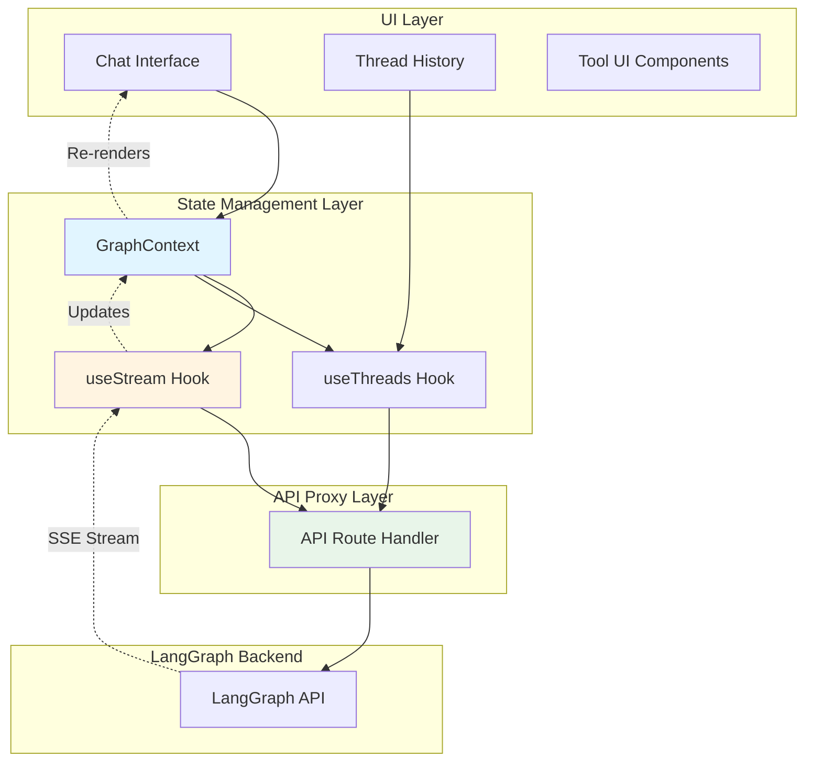
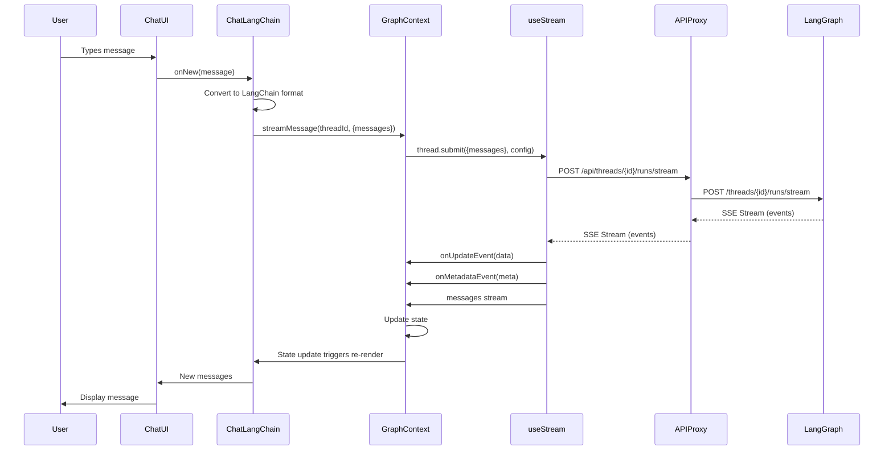

# Understanding Chat LangChain > Frontend Architecture & LangGraph API Integration

A comprehensive guide to understanding how Chat LangChain's frontend integrates with LangGraph API to build a sophisticated real-time chat interface with streaming, state management, and thread persistence.

> **Learning Journey:** This is part of my exploration of the [Chat LangChain](https://github.com/langchain-ai/chat-langchain) open-source project.
>
> **Source Repository:** [langchain-ai/chat-langchain](https://github.com/langchain-ai/chat-langchain)  
> **Practice Repository:** [thongvmdev/chat-langchain-practice](https://github.com/thongvmdev/chat-langchain-practice)

---

## 🚨 Problem & Solution

### The Challenge

After mastering the backend LangGraph workflows, I wanted to understand how to build a **production-ready frontend** that can:

1. **Stream responses in real-time** as the graph executes
2. **Manage complex state** across multiple conversation threads
3. **Handle LangGraph API integration** seamlessly
4. **Display rich UI components** for research progress, documents, and tool calls
5. **Maintain conversation history** and thread persistence

Simple chat UIs send messages and wait for responses. But how do you stream partial results? How do you handle multiple conversation threads? How do you integrate with LangGraph's sophisticated API? How do you convert between different message formats?

### The Solution: React + LangGraph SDK + Assistant UI

I discovered that Chat LangChain uses a **sophisticated frontend architecture** combining:

**Key Technologies:**

- **React Context API**: Centralized state management for messages, threads, and user data
- **LangGraph SDK**: Official SDK for seamless API integration
- **Assistant UI**: Pre-built chat components with streaming support
- **Next.js API Routes**: Proxy layer for secure backend communication
- **TypeScript**: Full type safety across the stack

**Benefits:**

- ✅ **Real-Time Streaming**: Progressive updates as the graph executes
- ✅ **Thread Management**: Multiple conversation sessions with persistence
- ✅ **Type Safety**: Full TypeScript coverage prevents runtime errors
- ✅ **Modular Design**: Clear separation between state, UI, and API layers
- ✅ **Rich UI Components**: Visual feedback for research progress, documents, and tool calls

---

## Table of Contents

1. [Architecture Overview](#architecture-overview)
2. [Core Components](#core-components)
3. [Data Flow](#data-flow)
4. [LangGraph API Integration](#langgraph-api-integration)
5. [State Management](#state-management)
6. [Message Conversion](#message-conversion)
7. [Key Learnings](#key-learnings)

---

## Architecture Overview

### Three-Layer Design

The frontend uses a **hierarchical architecture** with three main layers:

1. **API Proxy Layer** (`app/api/[..._path]/route.ts`): Secure proxy to LangGraph backend

   - Handles CORS
   - Adds authentication headers
   - Routes requests to backend

2. **State Management Layer** (`app/contexts/GraphContext.tsx`): Centralized state and streaming

   - Message state management
   - Thread management
   - Real-time streaming via `useStream` hook
   - Event handling (progress, documents, router logic)

3. **UI Layer** (`app/components/`): React components for user interaction
   - Chat interface with Assistant UI
   - Tool UI components (progress, documents, questions)
   - Thread history sidebar

**Why This Design?**

This separation provides:

- **Security**: API proxy prevents exposing backend URLs
- **Separation of Concerns**: State, API, and UI are cleanly separated
- **Reusability**: Components can be used independently
- **Testability**: Each layer can be tested in isolation



---

## Core Components

### 1. GraphContext.tsx 🔴 **HIGHEST PRIORITY**

**Location:** `app/contexts/GraphContext.tsx`

**Purpose:** Centralized state management and streaming orchestration

#### Key Responsibilities

1. **Streaming Setup**: Configures `useStream` hook for real-time updates
2. **Message Management**: Maintains conversation state
3. **Event Handling**: Processes updates, metadata, and lifecycle events
4. **Thread Coordination**: Manages thread creation and switching

#### Core Implementation

```typescript
// Streaming configuration
const thread = useStream({
  apiUrl: 'http://localhost:3000/api',
  assistantId: 'chat',
  streamMode: ['messages-tuple', 'updates'],
  onUpdateEvent: (data) => {
    // Handle progress, documents, router logic
  },
  onMetadataEvent: (meta) => {
    // Track run_id and configuration
  },
  onFinish: (state) => {
    // Finalize run
  },
})
```

#### Event Types Handled

1. **Progress Events**: Research step progress indicators
2. **Generating Questions**: Display research queries being generated
3. **Router Logic**: Show query routing decisions
4. **Selected Documents**: Display retrieved documents
5. **Answer Header**: Mark answer section start
6. **LangSmith Links**: Trace links for debugging

#### State Management Pattern

```typescript
interface GraphData {
  runId: string
  isStreaming: boolean
  messages: Message[]
  selectedModel: ModelOptions
  streamMessage: (threadId: string, params: GraphInput) => Promise<void>
  switchSelectedThread: (thread: Thread) => void
}
```

**Key Insight:** The context manages both **local React state** (messages, UI state) and **streaming state** (from LangGraph), merging them seamlessly for the UI.

---

### 2. ChatLangChain.tsx 🟠 **HIGH PRIORITY**

**Location:** `app/components/ChatLangChain.tsx`

**Purpose:** Main chat orchestrator that bridges Assistant UI and GraphContext

#### Key Responsibilities

1. **Message Submission**: Converts user input to LangGraph format
2. **Message Conversion**: Transforms between LangChain and Assistant UI formats
3. **Runtime Setup**: Configures Assistant UI runtime with external state
4. **Thread Management**: Handles thread creation and URL synchronization

#### Message Submission Flow

```typescript
async function onNew(message: AppendMessage): Promise<void> {
  // 1. Convert Assistant UI message to LangChain format
  const humanMessage: Message = {
    type: 'human',
    content: message.content[0].text,
    id: uuidv4(),
  }

  // 2. Update local state immediately (optimistic update)
  setMessages((prevMessages) => [...prevMessages, humanMessage])

  // 3. Stream message to LangGraph backend
  await streamMessage(threadId ?? undefined, {
    messages: [convertToOpenAIFormat(humanMessage)],
  })
}
```

#### Message Conversion

```typescript
// Convert LangChain messages to Assistant UI format
const threadMessages = useExternalMessageConverter<Message>({
  callback: convertLangchainMessages,
  messages,
  isRunning,
})

// Setup runtime with external state
const runtime = useExternalStoreRuntime({
  messages: threadMessages,
  isRunning,
  onNew,
})
```

**Key Insight:** This component acts as a **translation layer** between Assistant UI's expected format and LangGraph's message format, enabling seamless integration.

---

### 3. API Proxy Route 🟡 **MEDIUM PRIORITY**

**Location:** `app/api/[..._path]/route.ts`

**Purpose:** Secure proxy to LangGraph backend

#### Implementation

```typescript
async function handleRequest(req: NextRequest, method: string) {
  // 1. Strip /api/ prefix from path
  const path = req.nextUrl.pathname.replace(/^\/?api\//, '')

  // 2. Forward request to LangGraph backend
  const res = await fetch(`${process.env.API_BASE_URL}/${path}${queryString}`, {
    method,
    headers: {
      'x-api-key': process.env.LANGCHAIN_API_KEY || '',
    },
    body: method !== 'GET' ? await req.text() : undefined,
  })

  // 3. Return response with CORS headers
  return new NextResponse(res.body, {
    status: res.status,
    headers: {
      ...res.headers,
      ...getCorsHeaders(),
    },
  })
}
```

#### Why a Proxy?

1. **Security**: Hides backend URL from client
2. **CORS Handling**: Centralized CORS configuration
3. **Authentication**: Adds API keys server-side
4. **Path Transformation**: Simplifies client-side API calls

**Key Insight:** The proxy enables the frontend to call LangGraph API endpoints as if they were local Next.js routes, simplifying client-side code.

---

### 4. useThreads Hook 🟡 **MEDIUM PRIORITY**

**Location:** `app/hooks/useThreads.tsx`

**Purpose:** Thread CRUD operations using LangGraph SDK

#### Key Operations

```typescript
// Create LangGraph SDK client
const client = new Client({
  apiUrl: process.env.NEXT_PUBLIC_API_URL ?? 'http://localhost:3000/api',
})

// Search threads by user metadata
const userThreads = await client.threads.search({
  metadata: { user_id: userId },
  limit: 100,
})

// Get specific thread
const thread = await client.threads.get(threadId)

// Delete thread
await client.threads.delete(threadId)
```

#### Thread Management Pattern

1. **Search**: Find all threads for a user using metadata filters
2. **Get**: Retrieve specific thread with full state
3. **Delete**: Remove thread and update UI state
4. **Sync**: Keep URL query params in sync with selected thread

**Key Insight:** The hook encapsulates all thread operations, making it easy to manage conversation history across the application.

---

## Data Flow

### Complete Message Flow

Understanding the data flow is crucial for debugging and extending the system:



### Step-by-Step Breakdown

#### Step 1: User Input

User types a message in the chat interface (`chat-interface/index.tsx`)

#### Step 2: Message Conversion

`ChatLangChain.onNew()` converts Assistant UI message format to LangChain format:

```typescript
const humanMessage: Message = {
  type: 'human',
  content: message.content[0].text,
  id: uuidv4(),
}
```

#### Step 3: State Update

Message is added to local state immediately (optimistic update):

```typescript
setMessages((prevMessages) => [...prevMessages, humanMessage])
```

#### Step 4: Stream Submission

`GraphContext.streamMessage()` calls `thread.submit()`:

```typescript
await thread.submit(
  { messages: [convertToOpenAIFormat(humanMessage)] },
  { config, metadata },
)
```

#### Step 5: API Request

Request goes through API proxy to LangGraph backend:

```
POST /api/threads/{thread_id}/runs/stream
→ POST /threads/{thread_id}/runs/stream (LangGraph)
```

#### Step 6: Streaming Response

LangGraph sends Server-Sent Events (SSE) with:

- **Messages**: Actual chat messages
- **Updates**: Progress, documents, router logic
- **Metadata**: Run IDs, configuration

#### Step 7: Event Handling

`useStream` hook processes events:

```typescript
onUpdateEvent: (data) => {
  // Handle progress, documents, etc.
  if (data.type === 'progress') {
    // Update progress UI
  }
  if (data.type === 'selected_documents') {
    // Display documents
  }
}
```

#### Step 8: State Merge

Events update React state, triggering re-renders:

```typescript
setMessages((prev) => {
  // Merge new messages from stream
  return [...prev, ...newMessages]
})
```

#### Step 9: UI Update

React re-renders components with new state, displaying:

- User message
- Progress indicators
- Retrieved documents
- Final AI response

---

## LangGraph API Integration

### Understanding the API Endpoints Used

The frontend integrates with several LangGraph API categories:

#### 1. Threads API

**Purpose:** Manage conversation sessions with persistent state

**Endpoints Used:**

```typescript
// Search threads by metadata
POST /threads/search
{
  "metadata": { "user_id": "user-123" },
  "limit": 100
}

// Get thread state
GET /threads/{thread_id}/state

// Get thread by ID
GET /threads/{thread_id}
```

**Use Case:** The frontend uses threads to:

- Maintain conversation history
- Persist state across page refreshes
- Support multiple concurrent conversations
- Enable thread switching in the sidebar

#### 2. Thread Runs API (Streaming)

**Purpose:** Execute graph runs with real-time streaming

**Endpoints Used:**

```typescript
// Create run with streaming
POST /threads/{thread_id}/runs/stream
{
  "assistant_id": "chat",
  "input": {
    "messages": [{ "role": "user", "content": "..." }]
  },
  "stream_mode": ["messages-tuple", "updates"]
}
```

**Use Case:** This is the **core endpoint** for chat functionality:

- Streams responses as the graph executes
- Provides intermediate updates (progress, documents)
- Enables real-time UI updates
- Supports resumable streams

#### 3. Stream Events

**Event Types Received:**

1. **Messages**: Actual chat messages (human, AI, system, tool)
2. **Updates**: Custom events for UI components
   - `progress`: Research step progress
   - `generating_questions`: Research queries
   - `router_logic`: Query routing decision
   - `selected_documents`: Retrieved documents
   - `answer_header`: Answer section marker
3. **Metadata**: Run configuration and IDs

**Processing Pattern:**

```typescript
onUpdateEvent: (data) => {
  switch (data.type) {
    case 'progress':
      // Update progress indicator
      break
    case 'selected_documents':
      // Display document cards
      break
    case 'generating_questions':
      // Show research questions
      break
  }
}
```

---

## State Management

### State Architecture

The frontend uses a **multi-level state management pattern**:

#### 1. Context State (GraphContext)

**Purpose:** Global application state

```typescript
interface GraphData {
  runId: string // Current run ID
  isStreaming: boolean // Streaming status
  messages: Message[] // Conversation messages
  selectedModel: ModelOptions // Selected LLM model
  setMessages: Dispatch<SetStateAction<Message[]>>
  streamMessage: (threadId, params) => Promise<void>
  switchSelectedThread: (thread: Thread) => void
}
```

#### 2. Streaming State (useStream)

**Purpose:** Real-time updates from LangGraph

```typescript
const thread = useStream({
  apiUrl: '...',
  assistantId: 'chat',
  streamMode: ['messages-tuple', 'updates'],
  // Event handlers merge streaming state into context state
})
```

#### 3. Thread State (useThreads)

**Purpose:** Thread list and management

```typescript
interface ThreadsData {
  isUserThreadsLoading: boolean
  userThreads: Thread[]
  getUserThreads: (userId: string) => Promise<void>
  getThreadById: (id: string) => Promise<Thread>
  deleteThread: (id: string) => Promise<void>
}
```

#### 4. Local Component State

**Purpose:** UI-specific state (loading, errors, etc.)

```typescript
const [isRunning, setIsRunning] = useState(false)
const [threadId, setThreadId] = useQueryState('threadId')
```

### State Synchronization

**Challenge:** Keeping multiple state sources in sync

**Solution:** Event-driven updates

1. **User Action** → Updates local state
2. **Stream Event** → Updates context state
3. **Thread Operation** → Updates thread state
4. **React Re-render** → UI reflects all state changes

---

## Message Conversion

### The Conversion Challenge

The frontend needs to convert between **three different message formats**:

1. **LangGraph Format**: What the backend expects/returns
2. **Assistant UI Format**: What the UI library expects
3. **OpenAI Format**: What's sent in API requests

### Conversion Functions

#### 1. LangChain → Assistant UI

```typescript
export const convertLangchainMessages = (
  message: Message,
): AssistantUiMessage => {
  switch (message.type) {
    case 'human':
      return {
        role: 'user',
        id: message.id,
        content: [{ type: 'text', text: messageContentToText(message) }],
      }
    case 'ai':
      return {
        role: 'assistant',
        id: message.id,
        content: [
          ...toolCallsContent, // Convert tool calls
          { type: 'text', text: messageContentToText(message) },
        ],
      }
    case 'tool':
      return {
        role: 'tool',
        toolName: message.name,
        toolCallId: message.tool_call_id,
        result: message.content,
      }
  }
}
```

#### 2. LangChain → OpenAI Format

```typescript
export function convertToOpenAIFormat(message: Message) {
  const textContent = messageContentToText(message)

  switch (message.type) {
    case 'human':
      return { role: 'user', content: textContent }
    case 'ai':
      return { role: 'assistant', content: textContent }
    // ... other types
  }
}
```

#### 3. Content Extraction

```typescript
export function messageContentToText(message: Message): string {
  const { content } = message
  if (typeof content === 'string') return content
  if (Array.isArray(content)) {
    return content
      .map((part) => {
        if (typeof part === 'string') return part
        if (part?.type === 'text') return part.text
        return ''
      })
      .filter(Boolean)
      .join('\n')
  }
  return ''
}
```

**Key Insight:** Message conversion is **bidirectional** and happens at multiple points:

- **Input**: Assistant UI → LangChain → OpenAI format
- **Output**: LangGraph → LangChain → Assistant UI format

---

## 🎓 Key Learnings

### 1. **Streaming Architecture: Event-Driven Updates**

One of the most important patterns I learned is how to handle **real-time streaming** with React:

```typescript
// Setup streaming hook
const thread = useStream({
  streamMode: ['messages-tuple', 'updates'],
  onUpdateEvent: (data) => {
    // Handle custom events (progress, documents, etc.)
  },
  onMetadataEvent: (meta) => {
    // Track run IDs and configuration
  },
})

// Submit message
await thread.submit({ messages }, { config })

// Stream automatically updates state via callbacks
```

**Benefits:**

- Real-time UI updates without polling
- Progressive rendering of long responses
- Rich feedback (progress, documents) during execution

### 2. **State Management: Context + Hooks Pattern**

The application uses a **hybrid state management approach**:

- **Context API**: Global state (messages, threads, user)
- **Custom Hooks**: Encapsulated logic (useThreads, useRuns, useUser)
- **Local State**: Component-specific state (loading, errors)

**Why This Works:**

- Context provides global access without prop drilling
- Hooks encapsulate complex logic and side effects
- Local state keeps components independent

### 3. **API Proxy: Security and Simplification**

The API proxy pattern provides multiple benefits:

```typescript
// Client calls local route
fetch('/api/threads/123/runs/stream')

// Proxy forwards to backend
fetch(`${API_BASE_URL}/threads/123/runs/stream`)
```

**Benefits:**

- Hides backend URL from client
- Centralized authentication
- CORS handling
- Path transformation

### 4. **Message Format Conversion: Three-Way Translation**

Understanding message conversion is crucial:

```
Assistant UI Format ↔ LangChain Format ↔ OpenAI Format
```

**Conversion Points:**

- **Input**: User message → LangChain → OpenAI → API
- **Output**: API → LangChain → Assistant UI → Display

**Key Insight:** Each format serves a different purpose:

- **Assistant UI**: Rich UI components (tool calls, content arrays)
- **LangChain**: Type-safe internal representation
- **OpenAI**: API compatibility

### 5. **Thread Management: Metadata-Based Organization**

Threads are organized using **metadata filters**:

```typescript
// Search threads by user
await client.threads.search({
  metadata: { user_id: userId },
  limit: 100,
})
```

**Benefits:**

- Easy filtering and organization
- No need for separate user-thread mapping table
- Flexible querying by any metadata field

### 6. **Type Safety: Full TypeScript Coverage**

The entire frontend is **fully typed**:

```typescript
// LangGraph SDK types
import type { Message, Thread } from '@langchain/langgraph-sdk'

// Custom types
interface GraphData {
  messages: Message[]
  streamMessage: (threadId: string, params: GraphInput) => Promise<void>
}
```

**Benefits:**

- Catch errors at compile time
- Better IDE autocomplete
- Self-documenting code
- Refactoring safety

---

## 🎯 Real-World Example

### User Query: "How do I build a RAG system?"

**Step 1: User Types Message**

```typescript
// User types in chat interface
const userMessage = 'How do I build a RAG system?'
```

**Step 2: Message Conversion**

```typescript
// ChatLangChain.onNew() converts to LangChain format
const humanMessage: Message = {
  type: 'human',
  content: userMessage,
  id: uuidv4(),
}

// Convert to OpenAI format for API
const apiMessage = convertToOpenAIFormat(humanMessage)
// { role: "user", content: "How do I build a RAG system?" }
```

**Step 3: Stream Submission**

```typescript
// GraphContext.streamMessage() submits to LangGraph
await thread.submit(
  { messages: [apiMessage] },
  {
    config: { configurable: { query_model: 'ollama/llama3.2' } },
    metadata: { user_id: userId },
  },
)
```

**Step 4: Streaming Events**

```typescript
// LangGraph sends events via SSE:

// Event 1: Progress
onUpdateEvent({ type: "progress", step: 1, total: 4 })

// Event 2: Generating Questions
onUpdateEvent({
  type: "generating_questions",
  questions: ["RAG architecture", "document ingestion", ...]
})

// Event 3: Selected Documents
onUpdateEvent({
  type: "selected_documents",
  documents: [Document(...), ...]
})

// Event 4: Messages (AI response)
messages: [{ type: "ai", content: "To build a RAG system..." }]
```

**Step 5: UI Updates**

```typescript
// Each event updates state and triggers re-render:

// Progress bar updates
<ProgressToolUI step={1} total={4} />

// Questions display
<GeneratingQuestionsToolUI questions={[...]} />

// Documents display
<SelectedDocumentsToolUI documents={[...]} />

// Final answer displays
<Message content="To build a RAG system..." />
```

**Result:** User sees progressive updates as the graph executes, with rich visual feedback at each step!

---

## 📚 Quick Reference

### Core Components

| Component           | Purpose                      | Key Features                                    |
| ------------------- | ---------------------------- | ----------------------------------------------- |
| `GraphContext.tsx`  | State management & streaming | `useStream` hook, event handlers, message state |
| `ChatLangChain.tsx` | Chat orchestrator            | Message conversion, runtime setup, thread sync  |
| `API Proxy`         | Backend communication        | Request forwarding, CORS, authentication        |
| `useThreads`        | Thread management            | Search, get, delete threads                     |

### LangGraph API Endpoints Used

| Endpoint                         | Purpose              | When Used                |
| -------------------------------- | -------------------- | ------------------------ |
| `POST /threads/search`           | Find user threads    | Loading thread list      |
| `GET /threads/{id}`              | Get thread state     | Thread switching         |
| `POST /threads/{id}/runs/stream` | Stream run execution | Every message submission |
| `DELETE /threads/{id}`           | Remove thread        | Thread deletion          |

### Message Types

```typescript
// LangChain Message Types
type Message =
  | { type: 'human'; content: string }
  | { type: 'ai'; content: string; tool_calls?: ToolCall[] }
  | { type: 'system'; content: string }
  | { type: 'tool'; name: string; content: any }

// Assistant UI Message Types
type AssistantUiMessage =
  | { role: 'user'; content: ContentPart[] }
  | { role: 'assistant'; content: ContentPart[] }
  | { role: 'tool'; toolName: string; result: any }
```

### Event Types

```typescript
// Custom Update Events
type UpdateEvent =
  | { type: 'progress'; step: number; total: number }
  | { type: 'generating_questions'; questions: string[] }
  | { type: 'router_logic'; decision: string }
  | { type: 'selected_documents'; documents: Document[] }
  | { type: 'answer_header' }
```

### State Management Pattern

```typescript
// Context provides global state
const { graphData, userData, threadsData } = useGraphContext()

// graphData: Messages, streaming, model selection
// userData: User ID, user preferences
// threadsData: Thread list, thread operations
```

---

## 🚀 Running the Frontend

### Development Setup

```bash
# Install dependencies
cd frontend
yarn install

# Set environment variables
# .env.local
NEXT_PUBLIC_API_URL=http://localhost:3000/api
NEXT_PUBLIC_ASSISTANT_ID=chat

# Root .env
API_BASE_URL=http://localhost:8123
LANGCHAIN_API_KEY=your-api-key

# Run development server
yarn dev
```

### Key Files to Study

1. **`app/contexts/GraphContext.tsx`** (lines 868-1170)

   - `useStream` hook setup
   - Event handlers
   - `streamMessage` function

2. **`app/components/ChatLangChain.tsx`** (lines 62-105)

   - `onNew` function
   - Message conversion
   - Runtime setup

3. **`app/api/[..._path]/route.ts`**
   - Request forwarding logic
   - Header handling

---

## 🎓 Takeaways

1. **Streaming enables real-time UX** - Progressive updates make the app feel responsive
2. **State management is critical** - Context + hooks pattern scales well
3. **API proxy simplifies integration** - Hides complexity from client code
4. **Message conversion is bidirectional** - Handle both input and output conversions
5. **Type safety prevents bugs** - Full TypeScript coverage catches errors early
6. **Thread management enables persistence** - Metadata-based organization is flexible
7. **Event-driven architecture scales** - Handle multiple event types cleanly

This architecture demonstrates how to build production-ready chat interfaces that integrate seamlessly with LangGraph's sophisticated backend workflows.

---

## 📖 Related Documentation

- **Backend Architecture**: See `FLOW_DOCUMENTATION.md` for LangGraph workflows
- **LangGraph API**: See `LANGGRAPH_API_USE_CASES.md` for API reference
- **Document Ingestion**: See `INGEST.md` for document processing
- **LangGraph SDK**: https://github.com/langchain-ai/langgraph-sdk
- **Assistant UI**: https://www.assistant-ui.com/
- **Chat LangChain Source**: https://github.com/langchain-ai/chat-langchain
